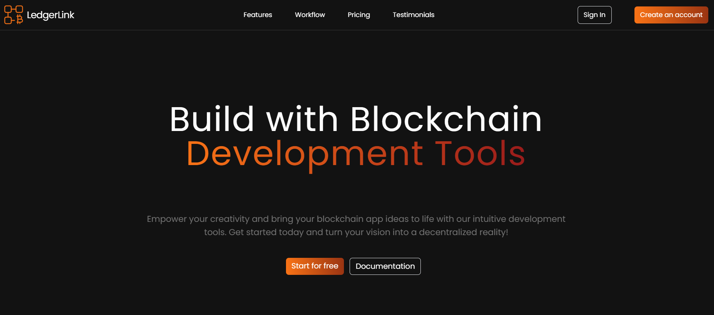
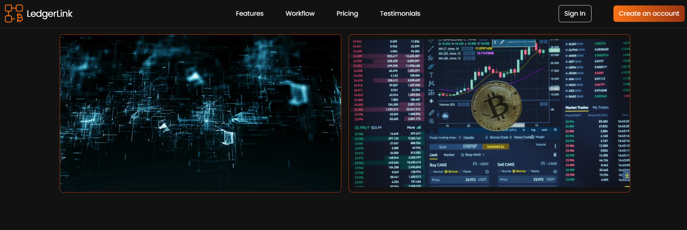
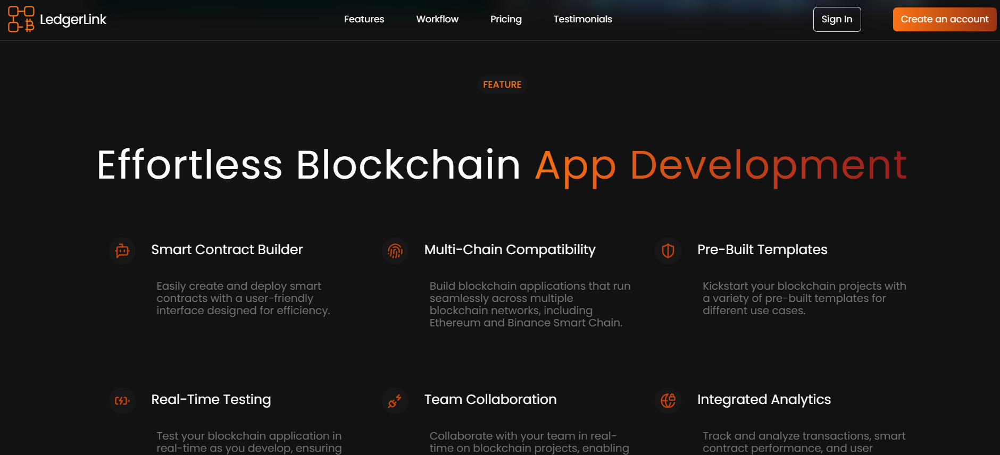
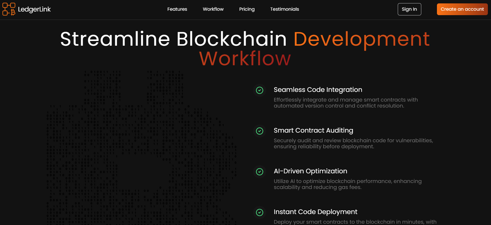
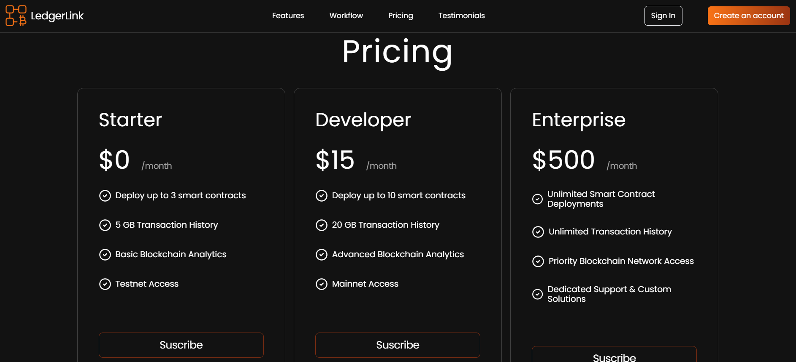
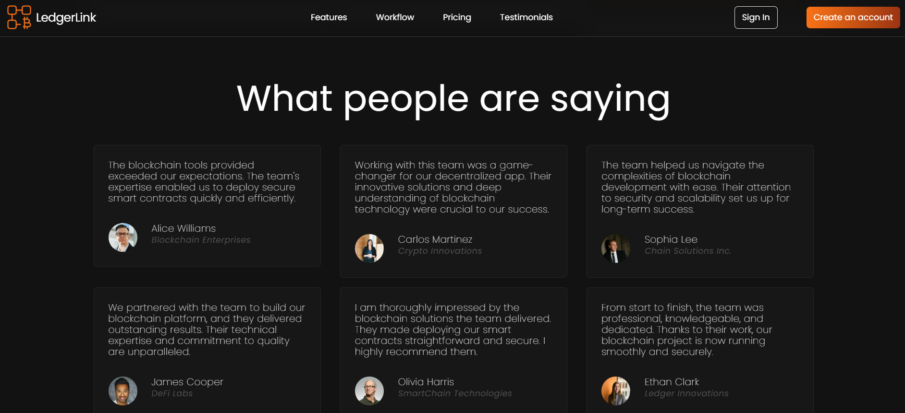
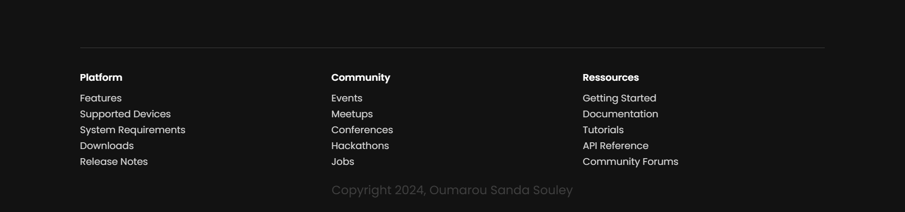

## Welcome to the React Landing Page Template! This project is a modern, customizable, and responsive landing page built with React.

## Features

- Fully responsive design
- Easy-to-edit components
- Built with React and modern tools
- Clean and reusable code structure

---

## Getting Started

Follow these steps to set up and run the project locally:

### Prerequisites

- Node.js (v14 or higher)
- npm (v6 or higher)

### Installation

1. Clone the repository: `git clone https://github.com/Gptsub333/Template_2.git`
2. Navigate to the project directory: `cd React-Landing-Page-Template`
3. Install dependencies: `npm install`

### Running the Development Server

Start the development server: `npm start`
The app will be available at [http://localhost:3000](http://localhost:3000).

### Building for Production

To create an optimized build for production: `npm run build`
The production-ready files will be in the `build/` directory.

---

## Screenshots

### Example Section

---

## License

## This project is licensed under the MIT License. Feel free to use, modify, and share it.

## Contributing

## Contributions are welcome! Please feel free to submit a pull request or create an issue.

## Contact

For any inquiries or support, please reach out to sales.queries@holbox.ai .
